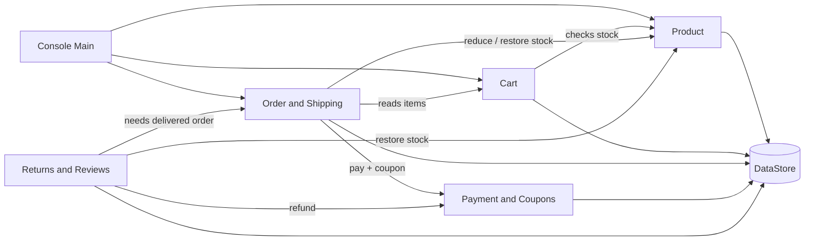

# System Diagram

```mermaid
flowchart LR
  Main[Console Main] --> P[Product]
  Main --> C[Cart]
  Main --> O[Order and Shipping]
  C -->|checks stock| P
  O -->|reads items| C
  O -->|reduce / restore stock| P
  O -->|pay + coupon| Pay[Payment and Coupons]
  R[Returns and Reviews] -->|needs delivered order| O
  R -->|restore stock| P
  R -->|refund| Pay
  P & C & O & Pay & R --> DS[(DataStore)]
```
